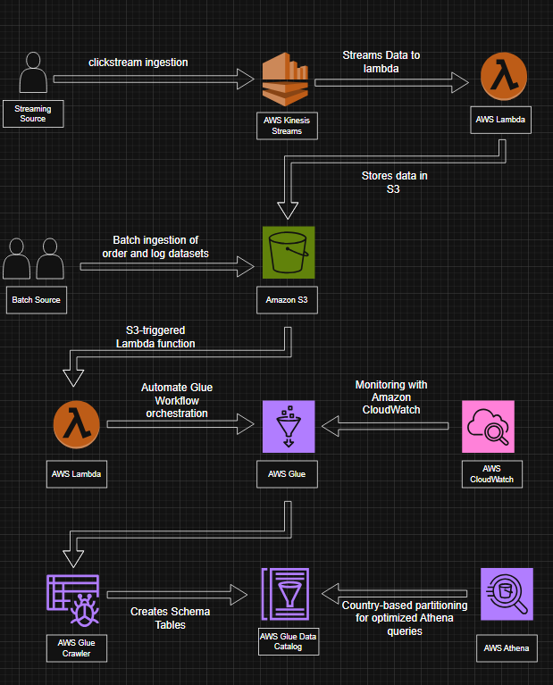

# Multi-Country E-commerce Behavioral Analytics Platform

A serverless AWS data engineering project that simulates a global e-commerce platform operating across India, UK, and Canada. The solution combines real-time clickstream ingestion and batch-based order/log processing using Amazon Kinesis, AWS Lambda, Amazon S3, AWS Glue ETL, Glue Workflows, and Amazon Athena.

The platform implements an event-driven architecture with a multi-zone data lake (Raw → Processed → Curated), automated ETL orchestration, data quality validation, partitioned datasets, and business-ready analytics.

---

# Architecture

<p align="center">
  
</p>


```text
Clickstream Producer
        │
        ▼
Amazon Kinesis
        │
        ▼
Clickstream Consumer Lambda
        │
        ▼
Raw S3 Zone

Orders Producer ───────► Raw S3 Zone
Logs Producer ─────────► Raw S3 Zone

Raw S3 Upload
        │
        ▼
Metadata Validator Lambda
        │
        ▼
AWS Glue Workflows
        │
        ▼
Raw → Processed ETL
        │
        ▼
Processed → Curated ETL
        │
        ▼
Curated Analytics Layer
        │
        ▼
Amazon Athena
```

---

# Features

- Real-time clickstream ingestion using Amazon Kinesis Data Streams
- Batch ingestion of order and log datasets
- Event-driven processing using S3-triggered Lambda functions
- Automated Glue Workflow orchestration
- Data quality validation and invalid record handling
- Raw → Processed → Curated data lake architecture
- Country-based partitioning for optimized Athena queries
- Customer, Sales, and Operational analytics datasets
- Monitoring with Amazon CloudWatch
- Governance using AWS CloudTrail and resource tagging

---

# Project Structure

```text
.
├── Lambda_function
│   └── metadata_validator.py
│
├── producers_functions
│   ├── clickstream_producer.py
│   ├── orders_producer.py
│   └── logs_producer.py
│
├── raw_to_processed
│   ├── clickstream_etl.py
│   ├── orders_etl.py
│   └── logs_etl.py
│
└── processed_to_curated
    ├── customer_analytics_etl.py
    ├── sales_analytics_etl.py
    └── operational_analytics_etl.py
```

---

# AWS Services Used

- Amazon Kinesis Data Streams
- AWS Lambda
- Amazon S3
- AWS Glue Crawlers
- AWS Glue ETL Jobs
- AWS Glue Workflows
- AWS Glue Data Catalog
- Amazon Athena
- Amazon CloudWatch
- AWS CloudTrail

---

# S3 Data Lake Structure

```text
ecommerce-analytics-lake-ishwar/

raw/
├── india/
│   ├── clickstream/
│   ├── orders/
│   └── logs/
│
├── uk/
│   ├── clickstream/
│   ├── orders/
│   └── logs/
│
└── canada/
    ├── clickstream/
    ├── orders/
    └── logs/

processed/
├── clickstream/
├── orders/
└── logs/

curated/
├── customer_analytics/
├── sales_analytics/
└── operational_analytics/

invalid/
├── clickstream/
├── orders/
└── logs/
```

---

# Setup Instructions

## Step 1: Create S3 Bucket

Create an S3 bucket:

```text
ecommerce-analytics-lake-ishwar
```

Create the following folder structure:

```text
raw/

raw/india/clickstream/
raw/india/orders/
raw/india/logs/

raw/uk/clickstream/
raw/uk/orders/
raw/uk/logs/

raw/canada/clickstream/
raw/canada/orders/
raw/canada/logs/

processed/clickstream/
processed/orders/
processed/logs/

curated/customer_analytics/
curated/sales_analytics/
curated/operational_analytics/

invalid/clickstream/
invalid/orders/
invalid/logs/
```

---

## Step 2: Create Kinesis Stream

Navigate to:

```text
Amazon Kinesis → Data Streams → Create Stream
```

Configuration:

```text
Stream Name: clickstream-stream
Capacity Mode: On-Demand
```

---

## Step 3: Create IAM Role for Clickstream Consumer Lambda

Role Name:

```text
clickstream-consumer-role
```

Attach managed policies:

```text
AWSLambdaBasicExecutionRole
AWSLambdaKinesisExecutionRole
```

Add custom policy:

```json
{
  "Version":"2012-10-17",
  "Statement":[
    {
      "Effect":"Allow",
      "Action":[
        "s3:PutObject"
      ],
      "Resource":"arn:aws:s3:::ecommerce-analytics-lake-ishwar/*"
    }
  ]
}
```

---

## Step 4: Create Clickstream Consumer Lambda

Lambda Name:

```text
clickstream-consumer
```

Runtime:

```text
Python 3.x
```

Role:

```text
clickstream-consumer-role
```

Deploy your Kinesis consumer code and add Kinesis trigger:

```text
clickstream-stream
```

---

## Step 5: Create IAM Role for Metadata Validator Lambda

Role Name:

```text
metadata-validator-role
```

Attach:

```text
AWSLambdaBasicExecutionRole
```

Add custom policy:

```json
{
  "Version": "2012-10-17",
  "Statement": [
    {
      "Effect": "Allow",
      "Action": [
        "glue:StartWorkflowRun"
      ],
      "Resource": "*"
    }
  ]
}
```

---

## Step 6: Create Metadata Validator Lambda

Lambda Name:

```text
metadata-validator
```

Deploy:

```text
Lambda_function/metadata_validator.py
```

---

## Step 7: Configure S3 Trigger

Configure:

```text
Bucket:
ecommerce-analytics-lake-ishwar

Event:
ObjectCreated

Prefix:
raw/
```

Target:

```text
metadata-validator
```

---

## Step 8: Create Glue Database

Database Name:

```text
ecommerce_db
```

---

## Step 9: Create Raw Crawler

Crawler Name:

```text
ecommerce-raw-crawler
```

Target:

```text
s3://ecommerce-analytics-lake-ishwar/raw/
```

Database:

```text
ecommerce_db
```

---

## Step 10: Create Raw → Processed ETL Jobs

Create:

```text
orders_etl
logs_etl
clickstream_etl
```

Upload scripts from:

```text
raw_to_processed/
```

---

## Step 11: Create Processed → Curated ETL Jobs

Create:

```text
sales_analytics_etl
operational_analytics_etl
customer_analytics_etl
```

Upload scripts from:

```text
processed_to_curated/
```

---

## Step 12: Create Glue Workflows

### orders_workflow

```text
orders_start_trigger
        ↓
orders_etl
        ↓
orders_curated_trigger
        ↓
sales_analytics_etl
```

### logs_workflow

```text
logs_start_trigger
        ↓
logs_etl
        ↓
logs_curated_trigger
        ↓
operational_analytics_etl
```

### clickstream_workflow

```text
clickstream_start_trigger
            ↓
clickstream_etl
            ↓
clickstream_curated_trigger
            ↓
customer_analytics_etl
```

---

## Step 13: Create Processed Crawler

Crawler Name:

```text
processed-crawler
```

Target:

```text
s3://ecommerce-analytics-lake-ishwar/processed/
```

---

## Step 14: Create Curated Crawler

Crawler Name:

```text
curated-crawler
```

Target:

```text
s3://ecommerce-analytics-lake-ishwar/curated/
```

---

## Step 15: Generate Sample Data

Run:

```bash
python producers_functions/orders_producer.py
python producers_functions/logs_producer.py
python producers_functions/clickstream_producer.py
```

This automatically triggers:

```text
Producer
    ↓
Raw S3
    ↓
Metadata Validator Lambda
    ↓
Glue Workflow
    ↓
Raw → Processed
    ↓
Processed → Curated
```

---

## Step 16: Run Crawlers

Run in order:

```text
1. ecommerce-raw-crawler
2. processed-crawler
3. curated-crawler
```

---

# Analytics Outputs

## Sales Analytics

- Revenue by country
- Total orders by country
- Average order value

## Customer Analytics

- Pages visited per user
- Orders placed per user
- Customer lifetime value

## Operational Analytics

- Login activity
- Search activity
- Application errors
- Event trends

---

# Sample Athena Queries

### Revenue by Country

```sql
SELECT *
FROM sales_analytics;
```

### Operational Analytics

```sql
SELECT *
FROM operational_analytics;
```

### Customer Analytics

```sql
SELECT *
FROM customer_analytics;
```

---

# Learning Outcomes

This project demonstrates:

- Streaming data ingestion using Amazon Kinesis
- Batch data ingestion using Amazon S3
- Event-driven architectures using AWS Lambda
- Data lake design (Raw → Processed → Curated)
- AWS Glue ETL development
- Workflow orchestration using Glue Workflows
- Data quality validation
- Athena-based serverless analytics
- Monitoring with CloudWatch
- Governance using CloudTrail
- Cost optimization through partitioned datasets
